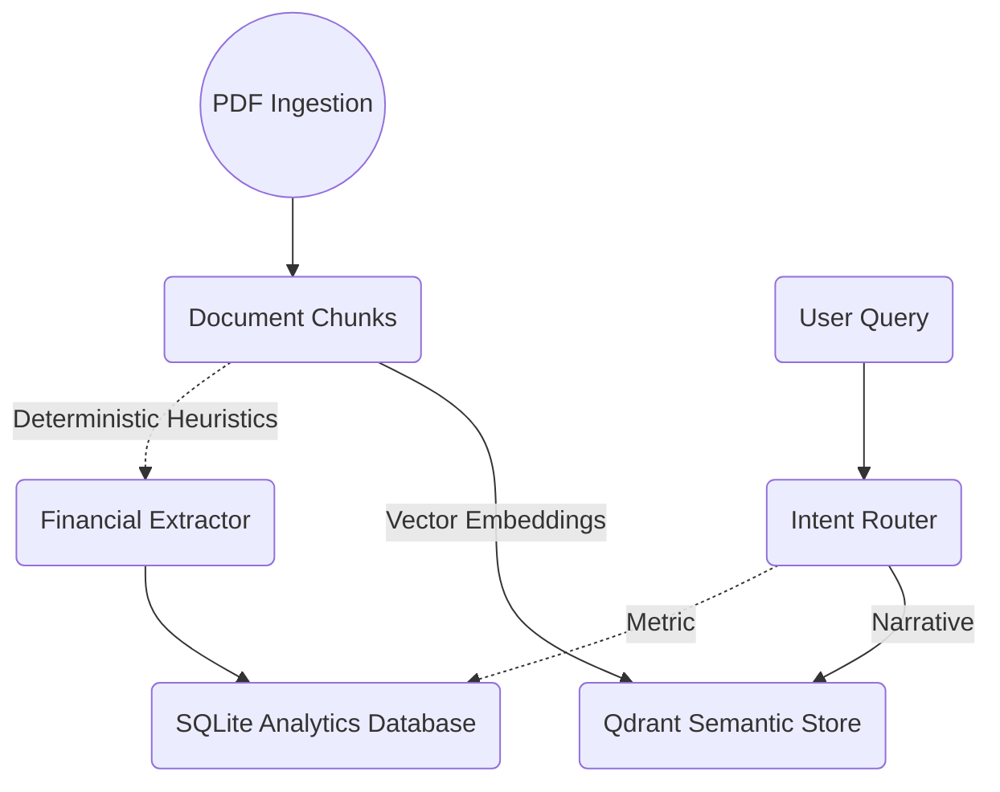

# FilingLens-IN 

A highly-scalable robust semantic search tool for querying financial filings, executing Retrieval Augmented Generation (RAG) using Ollama local endpoints, exposed elegantly over a native high-performance FastAPI standard instance.

## Installation and Setup

### 1. Install Dependencies
Ensure you have the virtual environment activated and dependencies installed:
```bash
python -m venv .venv
.venv\Scripts\activate
pip install -r requirements.txt
pip install fastapi uvicorn python-multipart
```

Ensure Ollama is installed on your local machine. You can download it directly from [Ollama.com](https://ollama.com).

### 2. Pull the Base Model
FilingLens relies on Qwen2.5 (3-Billion parameters) by default. Execute the following command in your terminal while the Ollama daemon is running:
```bash
ollama pull qwen2.5:3b
```

## Workflow and API Usage

You no longer need to depend strictly on standard batch execution. You can spin up the full infrastructure pipeline across a standard JSON routing environment executing natively over `localhost`.

### Starting the Server
Run the localized backend wrapping standard routes through standard asynchronous processes:
```bash
uvicorn filinglens.api.app:app --reload
```

### Navigating the Ecosystem
FilingLens deploys native Swagger documentation automatically defining interactive OpenAPI components natively.
* **Swagger UI:** [http://localhost:8000/docs](http://localhost:8000/docs)
* **ReDoc UI:** [http://localhost:8000/redoc](http://localhost:8000/redoc)

### Endpoints
* **`POST /process`** Upload `multipart/form-data` payloads ingesting PDFs dynamically parsing configurations using DocumentProcessor mappings context bounds.
* **`POST /index`** Run internal standard indexing wrappers utilizing existing chunked bounds directly into Qdrant.
* **`POST /ask`** Core component pipeline ingesting standard search parameters executing RAG retrieval across identical formats.
* **`GET /companies`** Query valid dataset domains currently initialized in systems.

---
### Command Line Usage
With the index and Ollama setup active, you can still submit analytical questions to the CLI directly:

```bash
python scripts/ask.py --company TCS --year FY2024 --question "What was the revenue growth in FY2024?"
```

---
### Testing
You do not need an active Ollama or Qdrant process to run unit tests. Assertions operate off HTTP intercept mocks mapping direct namespace JSON blobs via FastAPI overriding handlers.

```bash
.venv\Scripts\pytest
```

---
### Analytics & Telemetry
In Phase 4, FilingLens exposes native REST header endpoints returning computation metrics directly.
Look for `X-Process-Time`, `X-LLM-Time`, and `X-Retrieval-Time` directly on your network requests. 
All console metrics stream as JSON dicts across stdout handling request trace IDs dynamically.

## Docker & Container Deployments

We supply a production-ready `docker-compose.yml` that orchestrates:
1. `FilingLens API`
2. `Qdrant Vector Database`
3. `Ollama Provider Model`

You can launch all bound services via:
```bash
docker compose up -d
```
All system configurations map seamlessly through environment parameters. Clone `.env.example` to `.env` mapping variables targeting your environment.

## Performance & Evaluation Framework

To evaluate RAG logic independently, run the automated Benchmark Suite across built datasets targeting TCS, Infosys, and Reliance.

```bash
python scripts/evaluate.py
```

This iterates across native questions mapping logical metrics out to standard JSON reports in the `reports/` directory measuring `Recall@K`, `Precision@K`, `MRR`, `Citation Accuracy`, and `Context Coverage`.
All modules are comprehensively tested enforcing configurations across GitHub action `ci.yml` natively matching Pytest coverage.

## 8. Financial Intelligence Layer (Phase 5)

FilingLens natively extracts tabular arrays and numerical indicators completely bypassing LLMs resolving exact bounds natively via pre-trained mappings into local lightweight repositories. This structure routes intelligently classifying deterministic parameters optimally.

### Data Storage Architecture


### Extraction Workflow
Ingests explicit metrics (e.g. `Revenue`, `EBITDA`, `PAT`, `ROE`) from raw structural chunks explicitly pushing logic directly onto `finance.db`.

```bash
python scripts/extract_metrics.py --company TCS --year FY2024
```

### Metric API Routes

The `Finance API` natively retrieves extracted constraints natively without LLM delays:

* **`GET /metrics`**: Root query evaluating available mappings.
* **`GET /metrics/{company}/{year}`**: Returns comprehensive financial scalars evaluating structural bounds immediately.
* **`GET /metrics/query`**: Pass standard properties `?company=TCS&year=FY2024&metric=Revenue` parsing normalized configurations synchronously.
* **`POST /metrics/extract`**: Executes deterministic chunk processors extracting text natively resolving SQLite mappings dynamically across specific annual bounds.

## 9. Automated Filing Acquisition (Phase 5.0)

FilingLens operates a completely automated asynchronous acquisition manager eliminating manual PDF drops natively.

### Integrations
- **Company Registries**: Automatically resolves targets via `data/company_registry.json`.
- **Sources**: Iterates sequential constraints caching endpoints natively from `Investor Relations` -> `BSE` -> `NSE` -> `MCA`.
- **Checksum Storage Validation**: Cross-checks incoming PDF constraints verifying byte-sizes and actual PDF definitions implicitly via PyMuPDF logic blocking corrupt bindings accurately mapping onto `download_manifest.json` guarding `data/raw/COMPANY/YEAR/` flawlessly.

### Usage
Download an Annual Report explicitly and natively:
```bash
python scripts/download_filings.py --company TCS --latest
```

Execute Full-Cycle Processing mappings synchronously pulling, analyzing, indexing, and structuring targets effortlessly:
```bash
python scripts/build_company.py --company TCS --year FY2024
```

